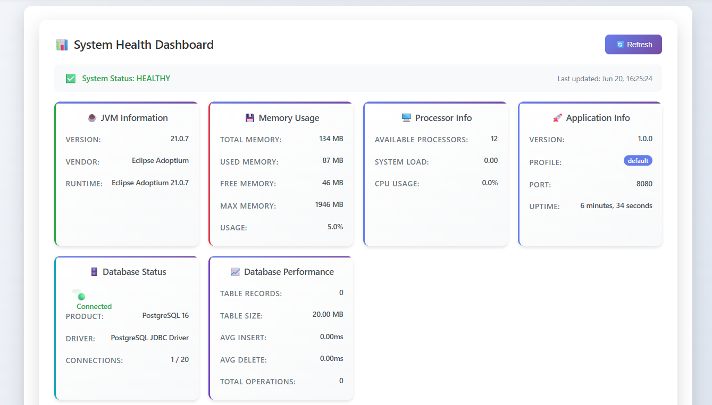
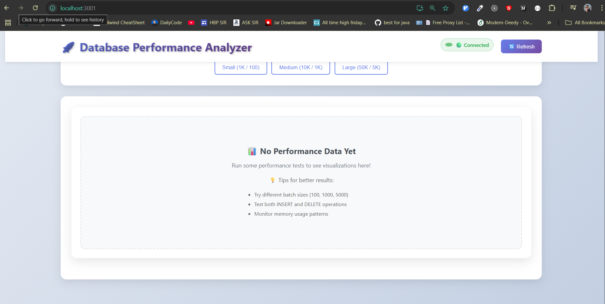
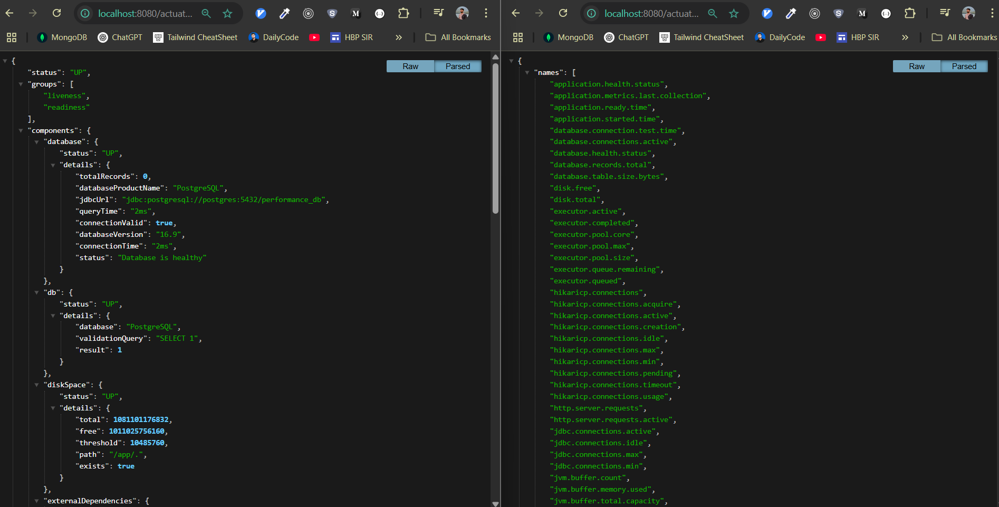
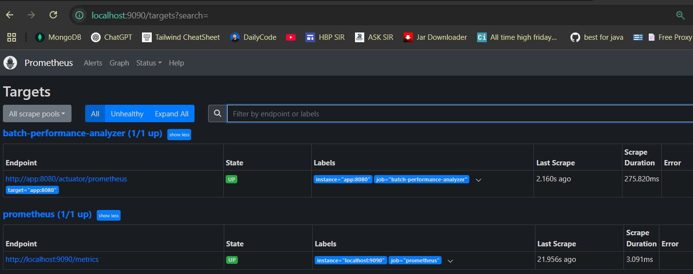
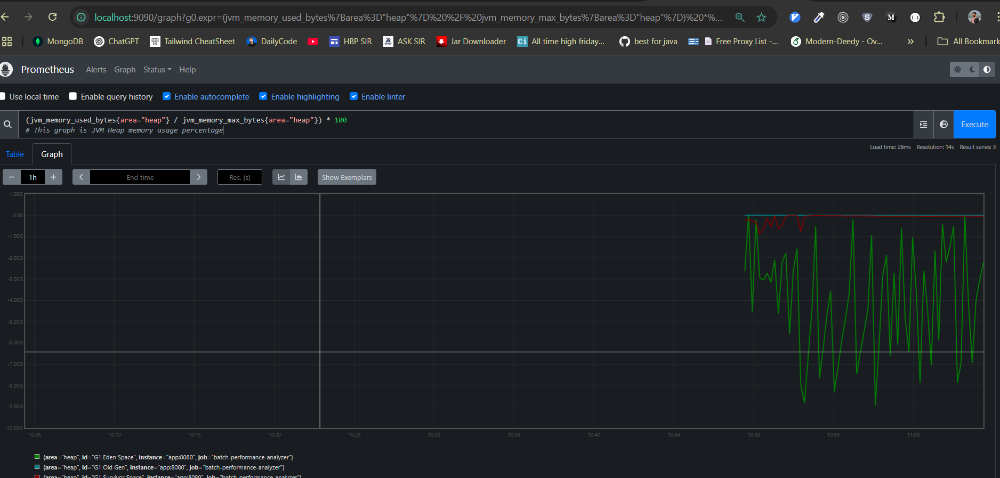
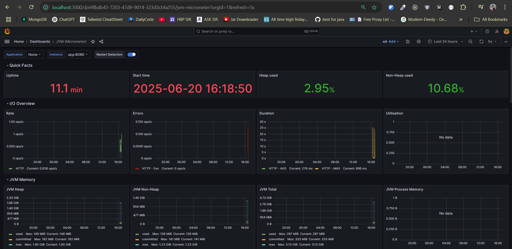
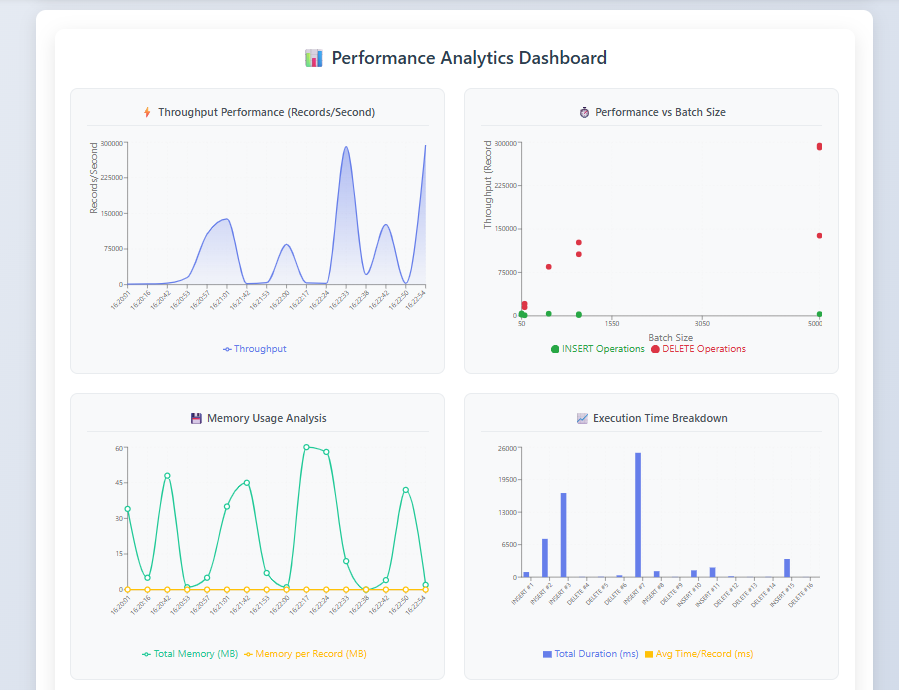

# 🚀 Database Batch Performance Analyzer

> **A comprehensive Spring Boot application for analyzing and visualizing database batch operation performance with real-time monitoring and interactive dashboards.**

[](https://openjdk.java.net/projects/jdk/21/)
[](https://spring.io/projects/spring-boot)
[](https://reactjs.org/)
[](https://www.typescriptlang.org/)
[](https://docs.docker.com/compose/)
[](https://www.postgresql.org/)
[](LICENSE)

## 📸 Project Screenshots
---------------------------------------------------------------------------------------------------------------------
|                 Dashboard Overview                        |           Performance Analytics                       | 
|:---------------------------------------------------------:|:-----------------------------------------------------:|
|        |    |
|        |    |
|                          |                      |
|                          |                      |
|                          |                                                       |
|     | |
|     | |
|     |                                                       |
|    |                                                       |
---------------------------------------------------------------------------------------------------------------------
---

## 🌟 Features

### 🎯 **Core Performance Testing**
- **Batch vs Single Operations**: Compare insert/delete performance with different batch sizes
- **Real-time Metrics**: Live monitoring of execution time, throughput, and resource usage
- **Memory Optimization**: Track heap usage and garbage collection during operations
- **Database Connection Pooling**: Optimized HikariCP configuration for maximum performance

### 📊 **Advanced Analytics & Visualization**
- **Interactive Dashboard**: Modern React-based UI with real-time charts
- **Performance Insights**: Detailed analysis of throughput, latency, and resource consumption
- **Historical Data**: Track performance trends over time
- **Comparative Analysis**: Side-by-side comparison of different batch configurations

### 🔐 **Enterprise Security**
- **Role-based Authentication**: Admin and viewer roles with different permissions
- **Secure Configuration**: Environment-based configuration management
- **API Security**: Protected endpoints with Spring Security
- **Audit Logging**: Comprehensive logging for security and troubleshooting

### 🐳 **Production-Ready Deployment**
- **Multi-Environment Support**: Development, staging, and production configurations
- **Docker Containerization**: Complete containerized setup with docker-compose
- **Monitoring Stack**: Integrated Prometheus + Grafana for production monitoring
- **Health Checks**: Comprehensive health monitoring and alerting

---

## 🏗️ Architecture Overview

```mermaid
graph TB
    subgraph "Frontend"
        A[React Dashboard] --> B[Material-UI Components]
        B --> C[Real-time Charts]
    end
    
    subgraph "Backend Services"
        D[Spring Boot API] --> E[Performance Service]
        D --> F[Metrics Service]
        D --> G[Security Service]
    end
    
    subgraph "Data Layer"
        H[PostgreSQL] --> I[HikariCP Pool]
        J[Redis Cache] --> K[Session Store]
    end
    
    subgraph "Monitoring"
        L[Prometheus] --> M[Grafana]
        N[Spring Actuator] --> L
    end
    
    A --> D
    E --> H
    F --> L
    D --> J
```

---

## 🚀 Quick Start

### Prerequisites

- **Java 21+** ☕
- **Node.js 18+** 🟢
- **Docker & Docker Compose** 🐳
- **Maven 3.8+** 📦

### 1. Clone the Repository

```bash
git clone https://github.com/mrvivekthumar/batch-performance-analyzer.git
cd batch-performance-analyzer
```

### 2. Set Up Environment Configuration

```bash
# Copy environment templates
cp Docker/.env.template Docker/.env
cp Docker/.env.prod.template Docker/.env.prod

# Edit with your secure passwords
nano Docker/.env
```

**Important**: Update the template files with secure passwords before proceeding!

### 3. Start with Docker (Recommended)

```bash
# Start all services
cd Docker
docker-compose up -d

# View logs
docker-compose logs -f app
```

### 4. Alternative: Local Development

```bash
# Backend
mvn clean compile
mvn spring-boot:run

# Frontend (in separate terminal)
cd client
npm install
npm start
```

### 5. Access the Application

| Service | URL | Credentials |
|---------|-----|-------------|
| **Main Dashboard** | http://localhost:8080 | admin / *your-password* |
| **Grafana Monitoring** | http://localhost:3000 | admin / *your-grafana-password* |
| **Prometheus Metrics** | http://localhost:9090 | - |
| **API Health Check** | http://localhost:8080/actuator/health | - |

---

## 📊 Usage Guide

### 🎯 Performance Testing Workflow

#### 1. **Initialize Test Data**
```bash
# Via UI Dashboard
1. Set total records (e.g., 1000)
2. Choose batch size (1 = single, 100 = batch)
3. Click "📝 INSERT Test"

# Via API
curl -X POST "http://localhost:8080/api/performance/initialize?totalRecords=1000&batchSize=100"
```

#### 2. **Run Deletion Tests**
```bash
# Via UI Dashboard
1. Set records to delete
2. Choose batch size
3. Click "🗑️ DELETE Test"

# Via API
curl -X POST "http://localhost:8080/api/performance/delete?totalRecords=1000&batchSize=100"
```

#### 3. **Analyze Results**
- View real-time performance charts
- Compare different batch sizes
- Monitor memory and CPU usage
- Export data for further analysis

### 📈 Example Test Scenarios

| Test Case     | Records | Batch Size | Expected Throughput | Memory Usage      |
|---------------|---------|------------|---------------------|-------------------|
| Single Insert | 1,000   |     1      | ~50 records/sec     | High per record   |
| Batch Insert  | 1,000   |    100     | ~2,000 records/sec  | Optimized         |
| Single Delete | 1,000   |     1      | ~30 records/sec     | Individual queries|
| Batch Delete  | 1,000   |    100     | ~1,500 records/sec  | Bulk operations   |
| Large Batch   | 10,000  |    1,000   | ~5,000 records/sec  | Memory efficient  |

---

## 🔧 Configuration

### Application Configuration

```yaml
# src/main/resources/application.yml
performance:
  test:
    batch-sizes: [1, 10, 100, 1000, 10000]
    metrics:
      collection-interval: 1000
      enable-system-metrics: true

spring:
  datasource:
    url: jdbc:postgresql://localhost:5433/performance_db
    hikari:
      maximum-pool-size: 50
      minimum-idle: 10
```

### Environment Variables

```bash
# Database
DB_HOST=postgres
DB_PASSWORD=your_secure_password

# Security
ADMIN_PASSWORD=your_admin_password
VIEWER_PASSWORD=your_viewer_password

# Monitoring
PROMETHEUS_ENABLED=true
GRAFANA_ADMIN_PASSWORD=your_grafana_password
```

### Docker Services Configuration

| Service         | Internal Port | External Port | Purpose               |
|-----------------|---------------|---------------|-----------------------|
| Spring Boot App | 8080          | 8080          | Main application      |
| PostgreSQL      | 5432          | 5433          | Database              |
| Redis           | 6379          | 6379          | Caching               |
| Prometheus      | 9090          | 9090          | Metrics collection    |
| Grafana         | 3000          | 3000          | Monitoring dashboards |

---

## 📈 API Documentation

### Core Performance Endpoints

#### Initialize Performance Test
```http
POST /api/performance/initialize
Parameters:
  - totalRecords: int (number of records to insert)
  - batchSize: int (batch size for operations)
  
Response:
{
  "executionTime": 1250,
  "recordsProcessed": 1000,
  "throughput": 800.0,
  "memoryUsed": 45.2
}
```

#### Delete Performance Test
```http
POST /api/performance/delete
Parameters:
  - totalRecords: int (number of records to delete)
  - batchSize: int (batch size for operations)
```

#### System Statistics
```http
GET /api/performance/stats/system
Response:
{
  "cpuUsage": 15.4,
  "memoryUsage": 68.2,
  "activeConnections": 12,
  "totalRequests": 1523
}
```

#### Database Statistics
```http
GET /api/performance/stats/database
Response:
{
  "totalRecords": 50000,
  "connectionPoolSize": 20,
  "activeConnections": 5,
  "queryExecutionTime": 12.4
}
```

### Monitoring Endpoints

```bash
# Application health
GET /actuator/health

# Prometheus metrics
GET /actuator/prometheus

# JVM metrics
GET /actuator/metrics

# Application info
GET /actuator/info
```

---

## 🏛️ Technology Stack

### **Backend Technologies**
- **Spring Boot 3.5.0** - Main application framework
- **Spring Data JPA** - Database operations and ORM
- **Spring Security** - Authentication and authorization
- **HikariCP** - High-performance connection pooling
- **Micrometer** - Application metrics collection
- **PostgreSQL 16** - Primary database
- **Redis** - Caching and session management

### **Frontend Technologies**
- **React 19.0.0** - Modern UI framework
- **TypeScript 5.7.2** - Type-safe JavaScript
- **Material-UI 6.3.0** - Component library
- **Recharts 2.13.3** - Interactive data visualization
- **React Query** - Data fetching and state management
- **Axios** - HTTP client for API calls

### **Monitoring & DevOps**
- **Prometheus** - Metrics storage and alerting
- **Grafana** - Advanced data visualization and dashboards
- **Docker Compose** - Multi-container deployment
- **Spring Boot Actuator** - Production monitoring endpoints
- **Maven** - Build automation and dependency management

### **Development Tools**
- **JMH (Java Microbenchmark Harness)** - Performance benchmarking
- **Logback** - Structured logging
- **JUnit 5** - Unit testing framework
- **Testcontainers** - Integration testing with containers

---

## 📊 Performance Insights & Benchmarks

### Typical Performance Results

#### **Throughput Analysis**
- **Single Operations**: 10-50 records/second
- **Small Batches (10-50)**: 200-800 records/second  
- **Optimal Batches (100-500)**: 1,000-5,000 records/second
- **Large Batches (1000+)**: 3,000-8,000 records/second

#### **Resource Utilization**
- **Memory Usage**: 10-50MB per 10K records (varies by batch size)
- **CPU Usage**: 15-40% during active operations
- **Database Connections**: 5-20 active connections (optimal pool size: 20-50)
- **Performance Improvement**: 90%+ with proper batching vs single operations

### Key Metrics Tracked

| Metric Category | Specific Metrics | Purpose |
|----------------|------------------|---------|
| **Execution Performance** | Total time, throughput, latency | Measure operation efficiency |
| **Resource Usage** | Heap memory, CPU utilization, GC time | Monitor system impact |
| **Database Performance** | Connection pool usage, query time | Optimize database operations |
| **Application Health** | Error rates, response times | Ensure system stability |

---

## 📁 Project Structure

```
batch-performance-analyzer/
├── 📁 src/main/java/com/vivek/           # Backend source code
│   ├── 📁 config/                        # Configuration classes
│   ├── 📁 controller/                    # REST API controllers
│   ├── 📁 service/                       # Business logic services
│   ├── 📁 entity/                        # JPA entities
│   ├── 📁 repository/                    # Data access repositories
│   └── 📁 security/                      # Security configurations
├── 📁 src/main/resources/                # Application resources
│   ├── 📄 application.yml                # Main configuration
│   ├── 📄 application-dev.yml            # Development config
│   └── 📄 application-docker.yml         # Docker config
├── 📁 client/                            # React frontend
│   ├── 📁 src/                           # Frontend source code
│   ├── 📁 public/                        # Static assets
│   └── 📄 package.json                   # Node.js dependencies
├── 📁 Docker/                            # Docker configuration
│   ├── 📄 docker-compose.yml             # Development setup
│   ├── 📄 docker-compose.prod.yml        # Production setup
│   ├── 📄 Dockerfile                     # Application container
│   ├── 📁 config/                        # Docker configurations
│   ├── 📁 scripts/                       # Deployment scripts
│   └── 📁 prometheus/                    # Monitoring config
├── 📁 docs/                              # Documentation
│   ├── 📁 images/                        # Screenshots and diagrams
│   ├── 📄 API.md                         # API documentation
│   └── 📄 DEPLOYMENT.md                  # Deployment guide
├── 📄 README.md                          # This file
├── 📄 pom.xml                            # Maven configuration
└── 📄 .gitignore                         # Git ignore rules
```

### 📸 Screenshots Location

**Create this folder structure for your images:**

```bash
mkdir -p docs/images
```

**Recommended image placement:**
- `docs/images/dashboard` - Main dashboard screenshot
- `docs/images/performance` - Analytics charts
- `docs/images/grafana-monitoring` - Grafana dashboards
- `docs/images/api-testing` - API testing examples

**Image guidelines:**
- **Size**: 1200x800px or 16:9 aspect ratio
- **Format**: PNG for screenshots, JPG for photos
- **Quality**: High resolution for clarity
- **Content**: Show key features and real data

---

## 🔍 Troubleshooting

### Common Issues & Solutions

#### **Port Conflicts**
```bash
# Problem: Port 8080 already in use
# Solution: Change application port
echo "server.port=8084" >> src/main/resources/application-local.yml

# Or use environment variable
SERVER_PORT=8084 mvn spring-boot:run
```

#### **Database Connection Issues**
```bash
# Check PostgreSQL status
docker-compose logs postgres

# Test database connection
docker-compose exec postgres psql -U postgres -d performance_db

# Reset database
docker-compose down -v
docker-compose up -d postgres
```

#### **Memory Issues**
```bash
# Increase JVM heap size for large datasets
export JAVA_OPTS="-Xmx4g -Xms2g"
mvn spring-boot:run

# Or in Docker
echo "JAVA_OPTS=-Xmx4g -Xms2g" >> Docker/.env
```

#### **Frontend Build Issues**
```bash
# Clear npm cache and reinstall
cd client
rm -rf node_modules package-lock.json
npm cache clean --force
npm install

# Use specific Node version
nvm use 18
npm install
```

### Performance Optimization Tips

1. **Batch Size Optimization**: Start with 100-500 records per batch
2. **Connection Pool Tuning**: Adjust based on concurrent users
3. **Memory Management**: Monitor heap usage during large operations
4. **Database Indexing**: Ensure proper indexes for performance queries

---

## 🧪 Testing

### Running Tests

```bash
# Backend tests
mvn test

# Frontend tests  
cd client
npm test

# Integration tests with Testcontainers
mvn test -Dtest=*IntegrationTest

# Performance benchmarks
mvn test -Dtest=*BenchmarkTest
```

### Test Coverage

- **Unit Tests**: Service layer and business logic
- **Integration Tests**: Database operations and API endpoints
- **Performance Tests**: Batch operation benchmarks
- **Security Tests**: Authentication and authorization

---

## 🚢 Deployment

### Production Deployment

#### **Docker Production Setup**
```bash
# Copy production environment
cp Docker/.env.prod.template Docker/.env.prod
# Edit with secure production passwords

# Deploy to production
cd Docker
docker-compose -f docker-compose.prod.yml --env-file .env.prod up -d
```

#### **Manual Deployment**
```bash
# Build application
mvn clean package -DskipTests

# Build frontend
cd client && npm run build

# Run with production profile
java -jar target/batch-performance-analyzer-*.jar --spring.profiles.active=prod
```

### Environment-Specific Configurations

| Environment | Profile | Database | Monitoring | Security |
|-------------|---------|----------|------------|----------|
| Development | `dev` | Local PostgreSQL | Basic logging | Relaxed |
| Docker | `docker` | Docker PostgreSQL | Prometheus | Standard |
| Production | `prod` | External DB | Full monitoring | Strict |

---

## 🤝 Contributing

We welcome contributions! Please follow these guidelines:

### Development Setup

1. **Fork the repository**
2. **Create a feature branch**: `git checkout -b feature/amazing-feature`
3. **Set up development environment**: Follow the Quick Start guide
4. **Make your changes** with tests
5. **Run tests**: `mvn test && cd client && npm test`
6. **Submit a pull request**

### Code Standards

- **Java**: Follow Google Java Style Guide
- **TypeScript**: Use ESLint and Prettier configurations
- **Git Commits**: Use conventional commit format
- **Documentation**: Update README and docs for new features

### Pull Request Process

1. Ensure all tests pass
2. Update documentation as needed
3. Add screenshots for UI changes
4. Provide clear description of changes
5. Request review from maintainers

---

## 📄 License

This project is licensed under the MIT License - see the [LICENSE](LICENSE) file for details.

---

## 🙏 Acknowledgments

- **Spring Boot Team** - For the excellent framework
- **React Community** - For the amazing frontend ecosystem  
- **Prometheus & Grafana** - For powerful monitoring tools
- **PostgreSQL** - For reliable database performance
- **Contributors** - Everyone who helped improve this project

---

## 📞 Support & Contact

- **📧 Email**: vivek@company.com
- **🐛 Issues**: [GitHub Issues](https://github.com/mrvivekthumar/batch-performance-analyzer/issues)
- **💬 Discussions**: [GitHub Discussions](https://github.com/mrvivekthumar/batch-performance-analyzer/discussions)
- **📖 Documentation**: [Project Wiki](https://github.com/mrvivekthumar/batch-performance-analyzer/wiki)

---

<div align="center">

**⭐ Star this repository if you find it helpful! ⭐**

Made with ❤️ by [Vivek](https://github.com/mrvivekthumar)

</div>